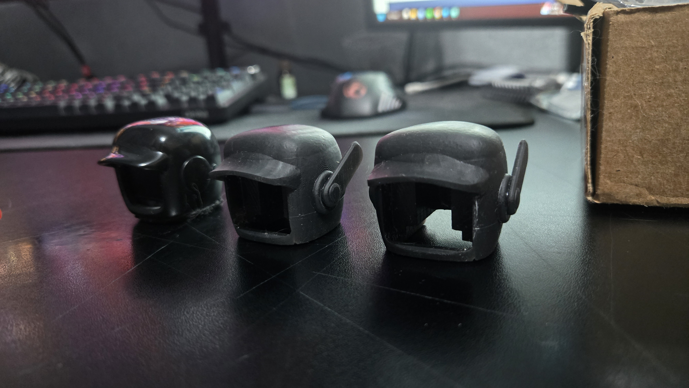
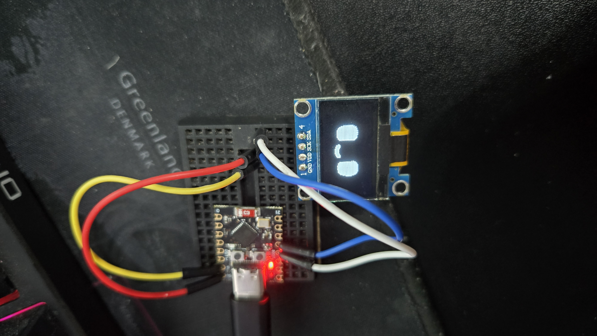
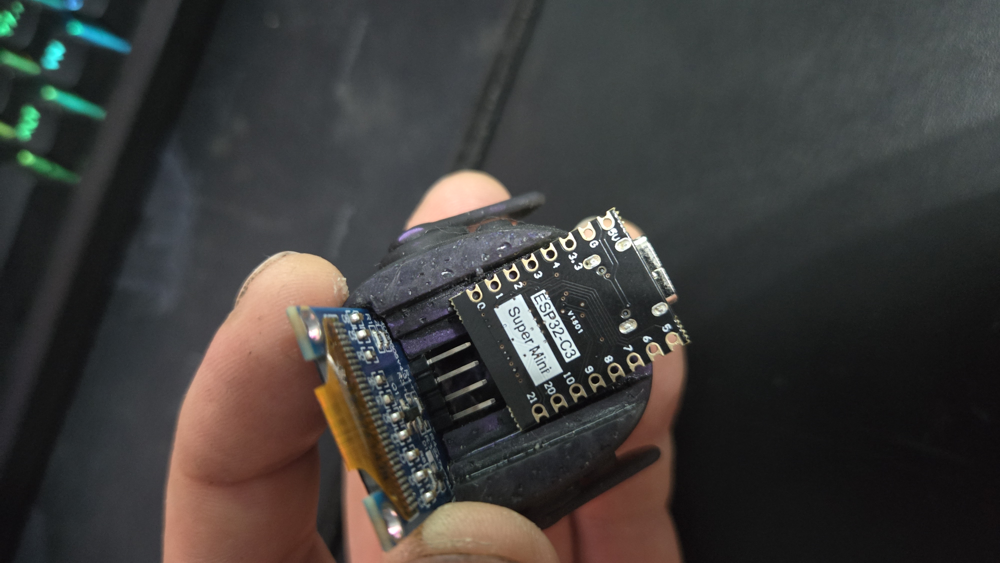
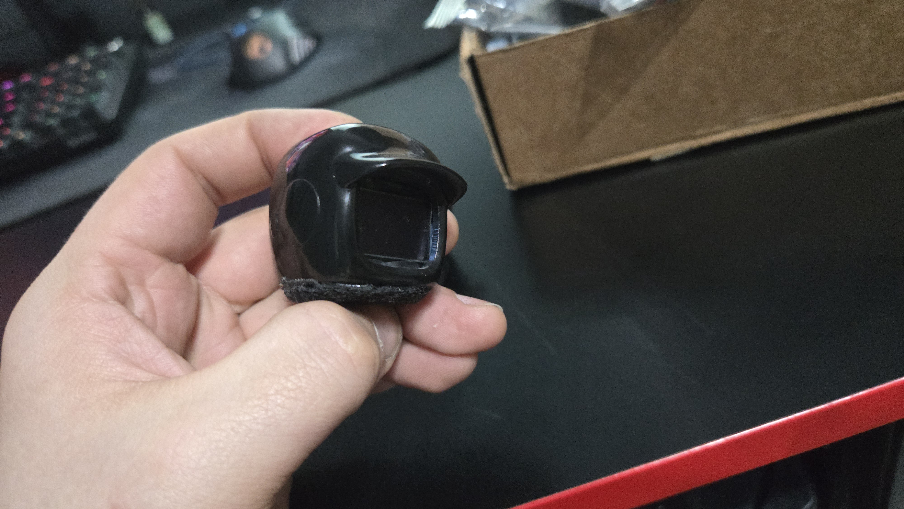

# FakeDasai

Клон популярного Dasai на базе ESP32-C3 с OLED-дисплеем 128x64 (SSD1306).

Все файлы для сборки и прошивки лежат в каталоге **DasaiOled**.

## Необходимые компоненты

- Дисплей 128x64 SSD1306  
  Пример: [Aliexpress](https://aliexpress.ru/item/32896971385.html)

- Плата ESP32-C3  
  Пример: [Aliexpress](https://aliexpress.ru/item/1005005969162660.html)  
  **Внимание!** Некоторые версии этих плат продаются без встроенной flash-памяти. Обязательно проверяй, чтобы на чипе было 4 строки текста.

Схемы подключения и что куда паять — легко гуглится по запросам типа "ESP32-C3 SSD1306 wiring".

## Прошивка

В Arduino IDE выбирай плату **ESP32C3 Dev Module**.  
Если её нет в списке — гугли "add ESP32-C3 to Arduino IDE".

## Кастомизация анимаций

В коде можно отключать ненужные анимации — просто закомментируй строку:
// case 35: playWrapper((uint8_t*)_42, sizeof(_42)); break;

Номера анимаций соответствуют GIF-файлам в корне проекта.

## Для тех, кто хочет свои анимации

В корне лежат два Python-скрипта:
- `png to h.py` — конвертирует последовательность PNG (по возрастанию имён) в .h-файл с бинарной анимацией
- `h to png and gif.py` — обратная конверсия .h → кадры PNG + GIF

После создания новой анимации:
1. Добавь её в файл `a.h`
2. Пропиши в списке воспроизведения в основном коде

Для работы скриптов нужны библиотеки Pillow и numpy (указано в коде и в ошибках при запуске).

Оригинальные анимации, которые удалось найти, лежат в папке **DASAI size color**.  
Если нарисуешь свои — кидай в issue или PR, народ будет благодарен 🙌

## 3D-модели

В папке **3D** — STL-файлы корпусов для Dasai.  
Если смоделируешь свой крутой кейс — тоже делись!

## Фото готовых устройств

